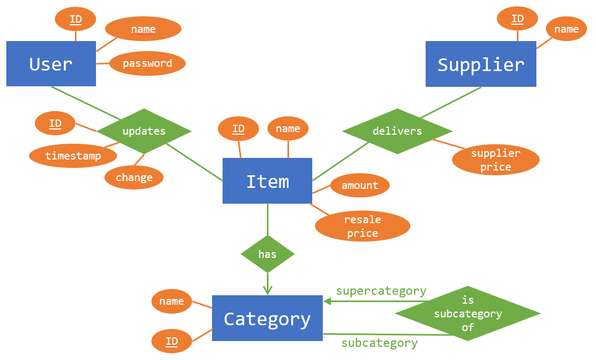

# POB &ndash; Inventory Management System

Charlotte (phk642), David (mwx499), and Julie (gtm740); June 9, 2024.

POB is a web-based Inventory Management System made for the Databases and Information Systems course at the University of Copenhagen.

## E/R Diagram

The database model for our app is illustrated in the following E/R Diagram:

## Setup

### Requirements

To run the project, Python and a PostgreSQL server must be installed (and added to your path).

Then, the necessary Python requirements for the Flask web server must be installed by running the following command in the project root directory:

    pip install -r requirements.txt

### Database

On Windows, you should run this command in a (regular) Command Prompt before importing data to insert it properly using UTF-8 encoding:

    set PGCLIENTENCODING=UTF8

The necessary database tables along with our example data can (then) be loaded into a database of your choice using this command:

    psql -d {database} -U {user} -f schema_ins.sql

Additionally, the connection to this same database should be set up in the `db.py` file. This file is generated in the project root directory automatically when first attempting to start the server.

### Usage

Finally, the web server can be accessed locally at port 5000 (by default) after starting it with this command (possibly using `py` instead of `python3` on Windows):

    python3 run.py

Custom users can be registered, but a default user `4243` with the password `4243` is included in our example data. When logged in, the app (with its Danish interface) allows you to see an overview of your current inventory, add (negative) amounts of items to your inventory, see a history of your inventory, and add new items to your inventory.
